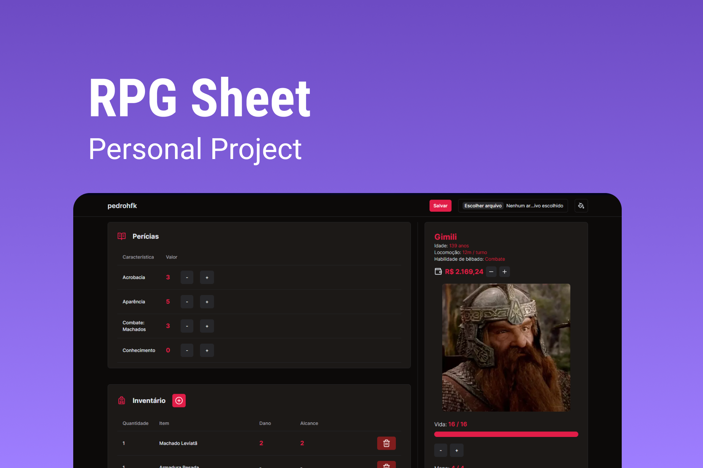
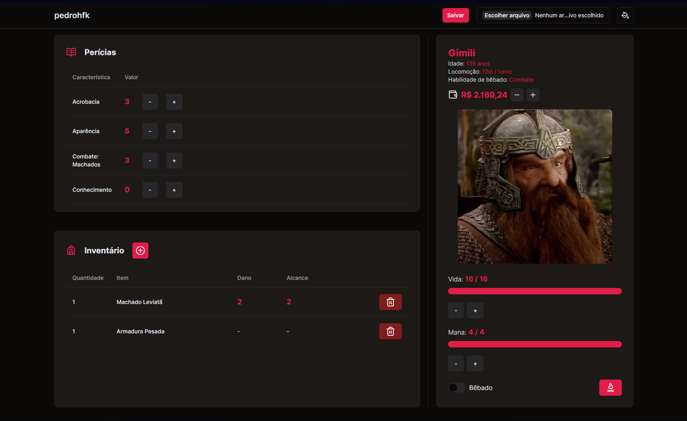

<h1 align="center" style="display: flex; align-items: center; width: 100%; justify-content: center; gap: 1rem;" >
    
RPG Sheet

</h1>

Este é um projeto com intúito de desenvolver uma ficha de RPG para um sistema de RPG que jogamos pois o mesmo não possui uma ficha própria. 

  <a href="#-tecnologias">Tecnologias</a>&nbsp;&nbsp;&nbsp;|&nbsp;&nbsp;&nbsp;
  <a href="#-projeto">Projeto</a>&nbsp;&nbsp;&nbsp;|&nbsp;&nbsp;&nbsp;
  <a href="#-layout">Layout</a>&nbsp;&nbsp;&nbsp;|&nbsp;&nbsp;&nbsp;
  <a href="#memo-licença">Licença</a>

  

 

  

## 🚀 Tecnologias

Esse projeto foi desenvolvido com as seguintes tecnologias:

- HTML, CSS e JavaScript
- Git e Github
- Biblotecas:
    - [react](https://pt-br.reactjs.org/)
    - [typescript](https://www.typescriptlang.org/)
    - [shadcn/ui](https://ui.shadcn.com/)
    - [lucide-react](https://lucide.dev/)
    - [react-router](https://reactrouter.com/)
    - [tailwindcss](https://tailwindcss.com/)
    - [eslint](https://eslint.org/)
    

## 💻 Projeto

  Algumas das funcionalidades são: personalização total, mudança da paleta de cores, controle de itens, dinheiro e perícias assim como da vida e mana.

  

- [Visite o projeto online](https://rpg-sheet-pi.vercel.app/)

## :memo: Licença

Esse projeto está sob a licença MIT.

---

## ✍ Author
 

    Made with 💜 by Pedro Henrique Klein

    
    

